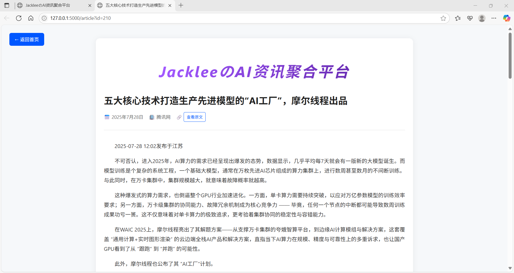

# JackleeのAI资讯聚合平台

一个基于AI驱动的高质量信息聚合与过滤系统，能够自动爬取、筛选和展示AI相关新闻资讯。

## 项目特色

- **AI智能筛选** - 使用DeepSeek Chat API进行内容质量评估
- **用户反馈系统** - 支持用户反馈，持续优化筛选算法
- **AI摘要生成** - 实时生成文章摘要，支持流式显示
- **自动更新** - 支持定时爬取最新资讯
- **响应式设计** - 适配各种设备屏幕
- **数据备份** - 完善的数据备份和还原机制
- **现代化界面** - 简洁美观的用户界面设计
- **实时交互** - 流畅的用户交互体验

## 功能特性

### 核心功能
- **多源爬取** - 支持虎嗅网、腾讯网、搜狐网等主流科技媒体
- **智能过滤** - 基于AI的质量评估和相关性判断
- **实时摘要** - AI一键生成50字左右的文章摘要
- **用户反馈** - 支持四种反馈类型，影响AI筛选权重
- **文章详情** - 完整的文章内容展示页面
- **搜索功能** - 支持标题关键词搜索
- **分页浏览** - 支持按时间排序和分页显示

### 技术特性
- **并行处理** - 多线程爬虫，提高数据获取效率
- **流式响应** - 实时显示AI生成内容
- **权重系统** - 智能调整不同反馈类型的权重
- **数据持久化** - SQLite数据库存储，支持增量更新
- **模块化设计** - 清晰的代码架构，易于维护和扩展
- **前端优化** - 现代化UI设计，流畅的用户体验
- **状态管理** - 实时显示系统运行状态

## 系统架构

### 完整目录结构

```
AI资讯聚合系统/
├── backend/                          # 后端服务模块
│   ├── app.py                       # Flask主应用
│   ├── config.py                    # API配置文件
│   ├── feedback.py                  # 用户反馈管理系统
│   ├── feedback.json                # 反馈数据存储
│   └── __pycache__/                 # Python缓存目录
├── frontend/                        # 前端界面模块
│   ├── index.html                   # 主页面
│   └── article.html                 # 文章详情页
├── scrapy/                          # 爬虫模块
│   ├── init_scrapy/                 # 初始爬虫脚本
│   │   ├── __init__.py              # 并行执行入口
│   │   ├── huxiu_titles_links_scrapy.py      # 虎嗅网爬虫
│   │   ├── sohu_titles_links_scrapy.py       # 搜狐网爬虫
│   │   ├── tencent_titles_links_scrapy.py    # 腾讯网爬虫
│   │   ├── merge_all_data.py        # 数据合并脚本
│   │   └── scrapy/                  # 子目录
│   ├── upd_scrapy/                  # 更新爬虫脚本
│   │   ├── huxiu_titles_links_scrapy_upd.py  # 虎嗅网更新爬虫
│   │   ├── sohu_titles_links_scrapy_upd.py   # 搜狐网更新爬虫
│   │   ├── tencent_titles_links_scrapy_upd.py # 腾讯网更新爬虫
│   │   └── merge_all_data_upd.py    # 更新数据合并脚本
│   ├── huxiu_data/                  # 虎嗅网数据存储
│   ├── sohu_data/                   # 搜狐网数据存储
│   ├── qq_data/                     # 腾讯网数据存储
│   └── all_data/                    # 合并数据存储
├── filter/                          # AI过滤模块
│   ├── init_filter/                 # 初始过滤脚本
│   │   ├── ai_titles_bert_filter.py # BERT过滤脚本
│   │   ├── ai_titles_ds_filter.py   # DeepSeek过滤脚本
│   │   ├── ai_titles_v1.txt         # 初始过滤结果
│   │   └── ai_titles_v2.txt         # 二次过滤结果
│   └── upd_filter/                  # 更新过滤脚本
│       ├── ai_titles_bert_filter_upd.py # BERT更新过滤脚本
│       ├── ai_titles_ds_filter_upd.py   # DeepSeek更新过滤脚本
│       ├── ai_titles_v1_upd.txt     # 更新初始过滤结果
│       └── ai_titles_v2_upd.txt     # 更新二次过滤结果
├── bind/                            # 数据绑定模块
│   ├── init_bind/                   # 初始绑定脚本
│   │   ├── bind.py                  # 数据绑定脚本
│   │   ├── title_link.txt           # 绑定结果文本
│   │   └── title_link.json          # 绑定结果JSON
│   └── upd_bind/                    # 更新绑定脚本
│       ├── bind_upd.py              # 更新数据绑定脚本
│       ├── title_link_upd.txt       # 更新绑定结果文本
│       └── title_link_upd.json      # 更新绑定结果JSON
├── get_article/                     # 文章内容获取模块
│   ├── __init__.py                  # 初始文章爬取入口
│   ├── __update__.py                # 更新文章爬取入口
│   ├── huxiu_crawler_artcle.py      # 虎嗅网文章爬虫
│   ├── sohu_crawler_artcle.py       # 搜狐网文章爬虫
│   ├── tencent_crawler_artcle.py    # 腾讯网文章爬虫
│   ├── articles_with_content.json   # 带内容的文章JSON
│   ├── updated_articles_with_content.json # 更新文章JSON
│   └── __pycache__/                 # Python缓存目录
├── database/                        # 数据库模块
│   ├── title_link.db                # SQLite数据库
│   ├── import_title_links.py        # 初始数据导入脚本
│   ├── import_title_links_upd.py    # 更新数据导入脚本
│   ├── read_db.py                   # 数据库读取脚本
│   └── read_articles.py             # 文章读取脚本
├── data_backup_v1/                  # 数据备份目录
│   ├── backup_info.json             # 备份信息
│   ├── backend/                     # 后端备份
│   ├── bind/                        # 绑定数据备份
│   ├── database/                    # 数据库备份
│   ├── filter/                      # 过滤数据备份
│   └── scrapy/                      # 爬虫数据备份
├── huxiu_data/                      # 根目录虎嗅数据 (与scrapy/huxiu_data同步)
├── sohu_data/                       # 根目录搜狐数据 (与scrapy/sohu_data同步)
├── qq_data/                         # 根目录腾讯数据 (与scrapy/qq_data同步)
├── all_data/                        # 根目录合并数据 (与scrapy/all_data同步)
├── backup_to_data_backup_v1.py      # 数据备份脚本
├── restore_from_backup_v1.py        # 数据还原脚本
├── clear_upd_files.py               # 清理更新文件脚本
├── README.md                        # 项目说明文档
├── LICENSE                          # 开源许可证
├── .gitignore                       # Git忽略文件
└── .git/                            # Git版本控制目录
```

### 数据流向架构

```
数据采集层 (Scrapy)
├── 虎嗅网爬虫 → huxiu_data/
├── 搜狐网爬虫 → sohu_data/
└── 腾讯网爬虫 → qq_data/
    ↓
数据合并层 (Merge)
└── all_data/ (合并所有数据源)
    ↓
AI过滤层 (Filter)
├── BERT过滤 → ai_titles_v1.txt
└── DeepSeek过滤 → ai_titles_v2.txt
    ↓
数据绑定层 (Bind)
└── title_link.json (结构化数据)
    ↓
内容获取层 (Get Article)
└── articles_with_content.json (完整文章)
    ↓
数据存储层 (Database)
└── title_link.db (SQLite数据库)
    ↓
应用服务层 (Backend + Frontend)
├── Flask API服务
└── 前端用户界面
```

### 更新流程架构

```
更新触发 → 并行爬虫 → 数据合并 → AI过滤 → 数据绑定 → 数据库导入 → 文章爬取 → 完成
    ↓         ↓         ↓         ↓         ↓         ↓         ↓
crawling   upd_data   merge     filter    bind      import    articles
```

## 快速开始

### 环境要求

- Python 3.8+
- Chrome浏览器（用于Selenium爬虫）
- DeepSeek API密钥

### 安装步骤

1. **克隆项目**
```bash
git clone https://github.com/your-username/high-quality-info-aggregation.git
cd high-quality-info-aggregation
```

2. **安装依赖**
```bash
pip install flask flask-cors requests beautifulsoup4 selenium sqlite3
```

3. **配置API密钥**
- 创建一个.env 文件（和你的 Python 脚本在同一目录）

- 然后输入：
```powershell
OPENAI_API_KEY=你的实际API密钥
```

4. **初始化数据库**
```bash
python database/import_title_links.py
```

5. **启动服务**
```bash
python backend/app.py
```

6. **访问系统**
打开浏览器访问：`http://localhost:5000`

## 使用指南

### 系统界面展示

#### 主页面 - 新闻列表


**主要功能区域：**
- **标题栏**：平台名称和排序选项（从新到旧/从旧到新）
- **搜索栏**：支持关键词搜索AI新闻标题
- **更新按钮**：一键更新最新数据
- **新闻卡片**：双列布局展示新闻标题、来源和日期
- **交互按钮**：每个卡片右下角的反馈(👎)和摘要(📝)按钮

#### 用户反馈系统


**反馈功能特点：**
- 点击👎按钮触发反馈模态框
- 四种反馈类型选择
- 帮助AI改进内容筛选质量

#### AI摘要生成


**摘要功能特点：**
- 点击📝按钮生成50字摘要
- 实时流式显示生成过程
- 支持关闭摘要显示

#### 文章详情页


**详情页功能：**
- 完整文章内容展示
- 来源网站和发布时间
- 返回首页导航

#### 数据更新状态


**更新流程状态：**
- 爬取数据中...
- AI分析中...
- 导入数据库中...
- 爬取文章内容中...
- 数据更新成功！

### 基本操作

1. **浏览新闻**
   - 首页显示最新的AI相关新闻
   - 支持按时间排序（从新到旧/从旧到新）
   - 每页显示20条新闻

2. **搜索功能**
   - 在搜索框输入关键词
   - 支持标题模糊搜索
   - 按回车键或点击搜索按钮

3. **查看详情**
   - 点击新闻标题查看完整文章
   - 支持新窗口打开
   - 显示文章标题、来源、日期和内容

4. **生成摘要**
   - 点击新闻卡片右下角的📝按钮
   - 实时显示AI生成的摘要
   - 点击右上角×按钮关闭摘要

5. **反馈功能**
   - 点击新闻卡片右下角的👎按钮
   - 选择反馈类型：
     - 这个新闻与AI无关
     - 标题过于浮夸
     - 实际内容质量低
     - 无理由

### 更新数据

1. **手动更新**
   - 点击页面右上角的"⟳ 更新"按钮
   - 系统会自动执行以下步骤：
     - 并行爬取最新数据
     - AI智能筛选
     - 数据绑定和导入
     - 文章内容爬取

2. **更新状态**
   - 爬取数据中...
   - AI分析中...
   - 导入数据库中...
   - 爬取文章内容中...

## 🔧 配置说明

### API配置 (`backend/config.py`)

```python
# DeepSeek API配置
DEEPSEEK_API_KEY = "your_api_key"
DEEPSEEK_API_URL = "https://api.deepseek.com/v1"

# 摘要生成配置
MAX_CONTENT_LENGTH = 1000  # 发送给API的最大内容长度
MAX_TOKENS = 100          # 生成摘要的最大token数
TEMPERATURE = 0.7         # 生成温度
```

### 数据库配置

系统使用SQLite数据库，表结构如下：

```sql
CREATE TABLE title_link (
    id INTEGER PRIMARY KEY AUTOINCREMENT,
    title TEXT,           -- 文章标题
    link TEXT,            -- 文章链接
    date TEXT,            -- 发布日期
    source TEXT,          -- 来源网站
    content TEXT          -- 文章内容
);
```

## 数据流程

### 1. 数据爬取
```
多源网站 → Selenium爬虫 → JSON数据文件
```

### 2. 数据筛选
```
原始数据 → AI质量评估 → 筛选结果
```

### 3. 数据绑定
```
筛选结果 → 数据绑定 → 结构化数据
```

### 4. 内容获取
```
文章链接 → 内容爬取 → 完整文章
```

### 5. 用户交互
```
用户操作 → 反馈收集 → AI权重调整
```

## 备份还原

### 数据备份
```bash
python backup_to_data_backup_v1.py
```

### 数据还原
```bash
python restore_from_backup_v1.py
```

备份内容包括：
- 爬虫数据文件
- 过滤结果文件
- 绑定数据文件
- 数据库文件
- 用户反馈数据

## 开发指南

### 添加新的数据源

1. **创建爬虫脚本**
```python
# scrapy/init_scrapy/new_source_scrapy.py
class NewSourceScrapy:
    def __init__(self):
        self.base_url = "https://news.example.com"
    
    def crawl_titles(self):
        # 实现爬取逻辑
        pass
```

2. **更新合并脚本**
```python
# scrapy/init_scrapy/merge_all_data.py
# 添加新数据源的合并逻辑
```

3. **创建文章爬虫**
```python
# get_article/new_source_crawler_article.py
class NewSourceArticleCrawler:
    def get_article_content(self, url):
        # 实现文章内容爬取
        pass
```

### 自定义AI筛选规则

编辑 `filter/init_filter/ai_titles_ds_filter.py`：

```python
def is_acceptable(title):
    # 自定义筛选逻辑
    system_prompt = "你的筛选标准..."
    user_prompt = f"判断标题：{title}"
    # 调用AI API
    return result
```

## 故障排除

### 常见问题

1. **爬虫无法启动**
   - 检查Chrome浏览器是否安装
   - 确认网络连接正常
   - 检查目标网站是否可访问

2. **AI摘要生成失败**
   - 验证API密钥是否正确
   - 检查网络连接
   - 确认API配额是否充足
   - 视频文件无法生成摘要

3. **数据库连接错误**
   - 检查数据库文件权限
   - 确认SQLite版本兼容性
   - 验证数据库文件完整性

4. **前端显示异常**
   - 清除浏览器缓存
   - 检查JavaScript控制台错误
   - 确认后端服务正常运行

### 日志查看

系统运行日志会输出到控制台，包括：
- 爬虫执行状态
- AI筛选结果
- 数据库操作记录
- 错误信息详情

## 性能优化

### 爬虫优化
- 使用多线程并行爬取
- 实现智能延时避免被封
- 支持断点续传

### 数据库优化
- 建立索引提高查询速度
- 定期清理过期数据
- 使用连接池管理连接

### 前端优化
- 图片懒加载
- 分页加载减少内存占用
- 缓存静态资源

## 贡献指南

1. Fork 项目
2. 创建功能分支 (`git checkout -b feature/AmazingFeature`)
3. 提交更改 (`git commit -m 'Add some AmazingFeature'`)
4. 推送到分支 (`git push origin feature/AmazingFeature`)
5. 打开 Pull Request

## 许可证

本项目采用 MIT 许可证 - 查看 [LICENSE](LICENSE) 文件了解详情

## 作者

**Jacklee** - *AI资讯聚合平台*

## 致谢

- [DeepSeek](https://www.deepseek.com/) - 提供AI API服务
- [Flask](https://flask.palletsprojects.com/) - Web框架
- [Selenium](https://selenium-python.readthedocs.io/) - 自动化测试工具
- [BeautifulSoup](https://www.crummy.com/software/BeautifulSoup/) - HTML解析库

## 联系方式

- 电子邮箱：b1520448594@gmail.com

---

⭐ 如果这个项目对你有帮助，请给它一个星标！ 
